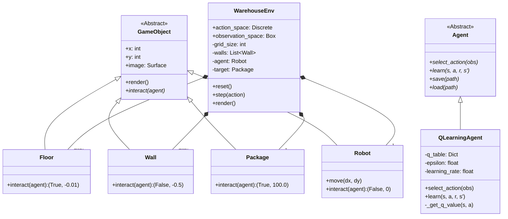
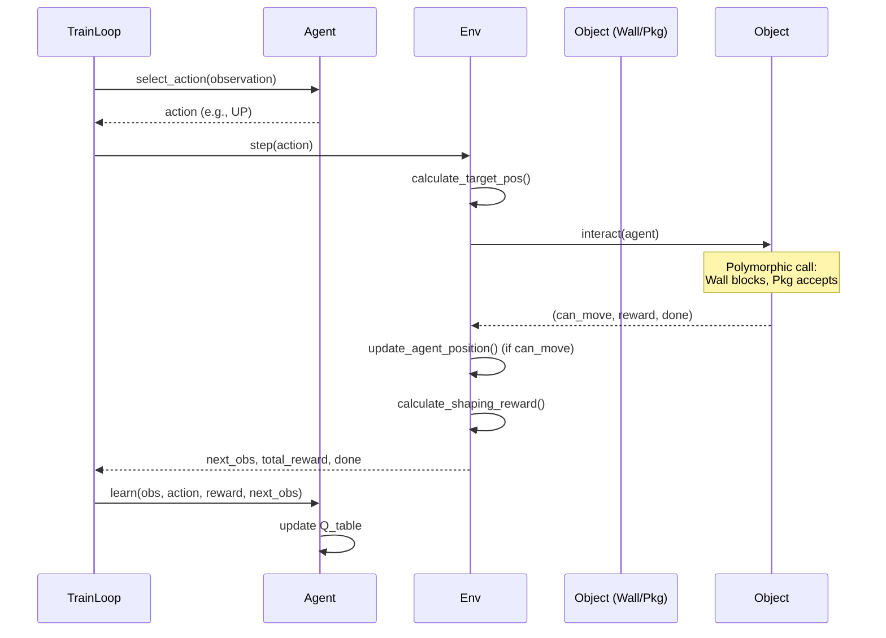

# Technical Report: Warehouse Robot Reinforcement Learning System

## 1. High-Level Overview

### 1.1 Purpose
The Warehouse Robot System is a comprehensive Machine Learning project designed to demonstrate the application of Reinforcement Learning (RL) in a simulated robotic environment. The primary objective is to develop an autonomous agent capable of navigating a grid-based warehouse to locate and collect packages while avoiding obstacles (walls). The system serves as a practical demonstration of Object-Oriented Programming (OOP) principles—specifically abstraction, inheritance, polymorphism, and encapsulation—applied to a complex software architecture.

### 1.2 Problem Description
The system solves a pathfinding and navigation problem in a discrete environment. The agent must:
1.  Perceive its current location and the location of the target package.
2.  Make decisions (move Up, Down, Left, or Right) to minimize distance to the target.
3.  Avoid static obstacles (walls) which incur penalties.
4.  Learn an optimal policy to maximize cumulative reward over time.

### 1.3 System Workflow
The program workflow follows a standard Reinforcement Learning cycle:
1.  **Environment Initialization**: A grid world is generated with a robot, a package, and randomized wall obstacles.
2.  **Observation**: The agent receives a state vector comprising coordinates of itself and the target.
3.  **Action Selection**: The agent selects an action (greedy or exploratory) based on its current policy (Q-table).
4.  **Interaction**: The environment processes the action, updates positions, and detects collisions via polymorphic interaction methods.
5.  **Feedback**: The environment returns a new state, a scalar reward, and a completion flag.
6.  **Learning**: The agent updates its internal Q-values using the Bellman equation.
7.  **Iterative Optimization**: This cycle repeats for thousands of episodes until convergence.

---

## 2. Detailed Code Explanation

### 2.1 `warehouse_env.py` (Environment Module)
**Role**: Defines the physical world, physics, and rendering logic. Extends the `gym.Env` interface.

**Key Components**:
*   **`GameObject` (Abstract Base Class)**: Represents any entity in the grid.
    *   *Attributes*: `x`, `y`, `image`, `color`.
    *   *Methods*: `interact()` (Abstract) forces subclasses to define unique collision behaviors; `render()` handles drawing.
*   **`Floor`, `Wall`, `Package`, `Robot` (Concrete Classes)**: Inherit from `GameObject`.
    *   *Polymorphism*: Each implements `interact(agent)` differently. E.g., `Wall` returns `False` (blocking), `Package` returns `True` and a high reward.
*   **`WarehouseEnv` (Class)**: The core simulation engine.
    *   *Attributes*: `grid_size`, `action_space` (Discrete), `observation_space` (Box), `q_table` (internal state handled by agent).
    *   *Methods*:
        *   `reset()`: Regents grid, randomly places objects/walls ensures solvability.
        *   `step(action)`: Applies movement logic, checks collisions via `interact()`, calculates dynamic rewards using Manhattan distance calculations.
        *   `render()`: Visualizes the state using Pygame.

**Interaction**: Calls `agent.select_action` indirectly through the training loop and receives actions to update the internal state.

### 2.2 `agent.py` (Agent Module)
**Role**: Defines the decision-making entities.

**Key Components**:
*   **`Agent` (Abstract Base Class)**: Defines the interface for all agents.
    *   *Methods*: `select_action()`, `learn()`, `save()`, `load()`.
*   **`QLearningAgent` (Concrete Class)**: Implements the Q-Learning algorithm.
    *   *Attributes*:
        *   `q_table` (Dict): Stores state-action values.
        *   `epsilon` (Float): Exploration rate.
        *   `alpha` (Float): Learning rate.
        *   `gamma` (Float): Discount factor.
    *   *Methods*:
        *   `select_action(state)`: Implements Epsilon-Greedy strategy (explores random actions with probability ε, exploits best action otherwise).
        *   `learn(state, action, reward, next_state)`: Updates Q-values using the Bellman equation:
            $Q(s,a) \leftarrow Q(s,a) + \alpha [r + \gamma \max Q(s',a') - Q(s,a)]$
        *   `save/load()`: Persists the learned Q-table using Python's `pickle` serialization.

### 2.3 `train_final.py` (Training Controller)
**Role**: Orchestrates the learning process.

**Key Components**:
*   **`train_final_optimized()`**: The main training loop.
    *   *Logic*: Runs for 5000 episodes. In each episode, it loops until the agent reaches the goal or times out. It calls `agent.learn()` at every step.
    *   *Optimization*: Implements periodic evaluation (every 100 episodes) to test the agent without exploration. Saves the model only if the success rate improves ("Best Model Checkpointing").
*   **`plot_training_curves_comprehensive()`**: Visualization utility.
    *   *Logic*: Uses Matplotlib to generate a 4-panel dashboard showing Rewards, Steps, Success Rate, and Epsilon decay over time.

### 2.4 `demo.py` & `main.py` (Execution Modules)
*   **`demo.py`**: Loads a pre-trained model and runs the environment in inference mode (no learning, greedy actions) to visualize performance.
*   **`main.py`**: A manual control interface allowing a human user to play the game, useful for debugging physics and collision logic.

---

## 3. UML Diagrams

### 3.1 Class Diagram
The following diagram illustrates the Object-Oriented architecture, highlighting the inheritance hierarchy and composition within the Environment.

### 3.2 Sequence Diagram (Step execution)
This diagram depicts the flow of a single time-step during training.

---

## 4. Design Rationale

### 4.1 Modular Architecture
The system is strictly divided into **Environment** (`warehouse_env.py`), **Agent** (`agent.py`), and **Controller** (`train_final.py`).
*   *Benefit*: Allows independent modification. For example, the agent can be switched from Q-Learning to Deep Q-Network (DQN) without changing a single line of the Environment code.

### 4.2 Object-Oriented Principles (OOP)
*   **Abstraction**: The `GameObject` and `Agent` classes define clear interfaces, hiding implementation complexities. The main loop doesn't need to know *how* an object renders or *how* an agent learns, only that they *do*.
*   **Polymorphism**: The `interact()` method is the core interaction mechanism. The collision logic is simplified to `obj.interact()`, eliminating complex `if type(obj) == Wall` chains. This makes adding new object types (e.g., "Ice", "Teleporter") trivial.
*   **Encapsulation**: `QLearningAgent` protects its `q_table`. External classes cannot directly corrupt the learning memory; they must use the `learn()` interface.

### 4.3 Scalability
The `WarehouseEnv` constructor accepts `grid_size` and `wall_density`. The rendering engine and coordinate system dynamically adjust to these parameters, allowing the system to scale from simple 8x8 grids to complex 20x20 mazes without code refactoring.

---

## 5. Assumptions and Limitations

### 5.1 Assumptions
*   **Discrete State Space**: The environment is a grid. The agent moves in 4 cardinal directions.
*   **Markov Property**: It is assumed that the current state (Robot XY, Package XY) contains all necessary information to make an optimal decision.
*   **Static Environment**: Walls and the target do not move during an episode.

### 5.2 Limitations
*   **Tabular Scalability**: Q-Learning uses a lookup table. If the grid size increases significantly (e.g., 100x100), the state space ($GridW \times GridH \times GridW \times GridH$) becomes too large for memory (Curse of Dimensionality). Deep Reinforcement Learning (DQN) would be required for larger grids.
*   **Global Layout Knowledge**: The agent currently observes absolute coordinates. It does not generalize well to completely new map layouts without retraining, as it learns "path to (X,Y)" rather than "path relative to obstacle".
*   **Single Agent**: The current architecture supports only one robot.

---
*Report generated for Warehouse Robot Project - December 2025*
