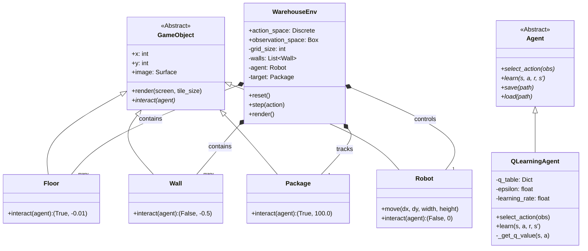
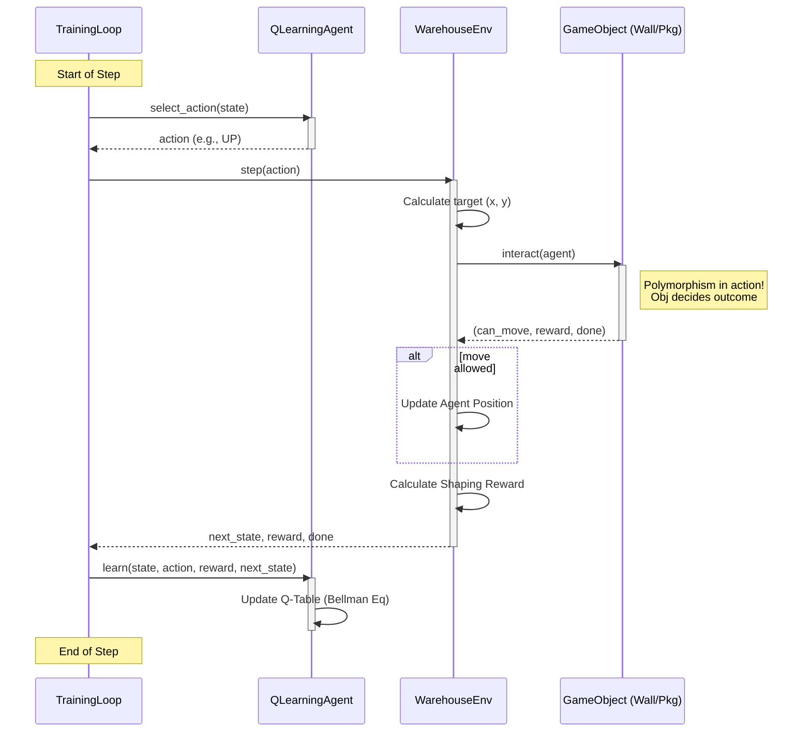

# Warehouse Robot - System UML Diagrams

This document contains visual representations of the system architecture and execution flow.

## 1. Class Diagram

This diagram shows the Object-Oriented structure, including Inheritance (GameObject hierarchy) and Composition (WarehouseEnv).

### 1.1 Mermaid Format (Renderable)



### 1.2 ASCII Art Format (Text-Based)

```text
       +------------------+
       |   GameObject     | (Abstract)
       +------------------+
       | + x: int         |
       | + y: int         |
       | + image          |
       +------------------+
       | + interact()*    | <--- Polymorphic Method
       | + render()       |
       +--------^---------+
                |
    +-----------+-----------+----------------+----------------+
    |           |           |                |                |
+---+---+   +---+---+   +---+-------+   +----+------+   +-----------+
| Floor |   | Wall  |   | Package   |   |   Robot   |   |   Agent   | (Abstract)
+-------+   +-------+   +-----------+   +-----------+   +-----------+
|inter- |   |inter- |   |interact() |   | move()    |   | select_()*|
|act()  |   |act()  |   |-> Reward! |   |           |   | learn()*  |
+-------+   +-------+   +-----------+   +-----------+   +-----^-----+
                                                              |
                                                       +------+-------+
                                                       | QLearningAgent|
  +--------------+                                     +---------------+
  | WarehouseEnv |                                     | - q_table     |
  +--------------+                                     | - epsilon     |
  | - agent      |<>-----------------------------------| + learn()     |
  | - walls      |<>--(contains many)- Wall            +---------------+
  | - target     |<>--(contains 1)---- Package
  | - grid_size  |
  +--------------+
  | + reset()    |
  | + step()     |
  | + render()   |
  +--------------+
```

---

## 2. Sequence Diagram

This diagram shows the step-by-step execution flow of a single training step.

### 2.1 Mermaid Format (Renderable)



### 2.2 ASCII Art Format (Text-Based)

```text
TrainingLoop        Agent            WarehouseEnv      GameObject (Wall/Pkg)
     |                |                   |                    |
     | select_action()|                   |                    |
     |--------------->|                   |                    |
     |                |                   |                    |
     |    action      |                   |                    |
     |<---------------|                   |                    |
     |                |                   |                    |
     |  step(action)  |                   |                    |
     |--------------->|                   |                    |
     |                |  calc_target()    |                    |
     |                |-------------------|                    |
     |                |                   |                    |
     |                |    interact()     |                    |
     |                |--------------------------------------->|
     |                |                   |                    |
     |                |  (move, r, done)  |    Polymorphic     |
     |                |<---------------------------------------|
     |                |                   |     Response       |
     |                |                   |                    |
     |                | update_pos()      |                    |
     |                | [If move allowed] |                    |
     |                |---|               |                    |
     |                |   |               |                    |
     |                |<--|               |                    |
     |                |                   |                    |
     | obs, reward... |                   |                    |
     |<---------------|                   |                    |
     |                |                   |                    |
     |     learn()    |                   |                    |
     |--------------->|                   |                    |
     |                |                   |                    |
     | update_q()     |                   |                    |
     |---|            |                   |                    |
     |   |            |                   |                    |
     |<--|            |                   |                    |
     |                |                   |                    |
     v                v                   v                    v
```
